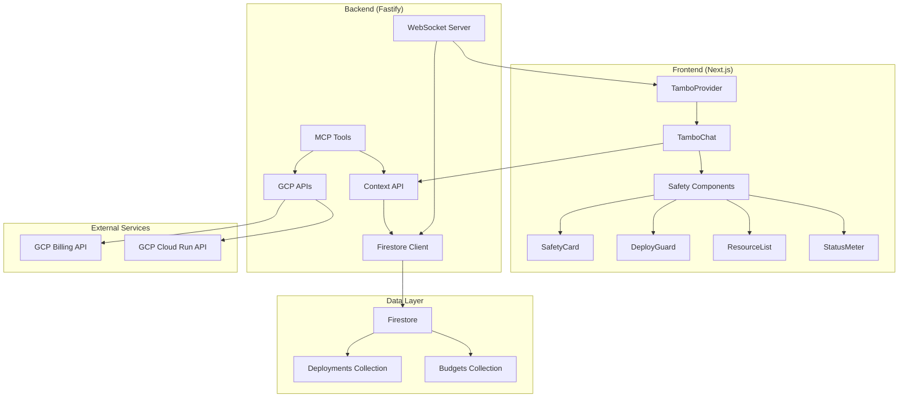

# Design Document

## Overview

SafeOps Co-pilot is a Tambo-powered cloud safety platform that prevents free tier overspend through generative UI components and real-time monitoring. The platform follows a pure generative UI approach where AI decides which safety components to render based on live cloud context, enabling proactive cost management across multiple cloud providers.

The system architecture centers around four core Tambo-registered components that provide different views of cloud safety status, backed by Firestore for real-time data synchronization and MCP tools for cloud provider integration.

## Architecture

### High-Level Architecture



### Component Architecture

The platform uses a component-driven architecture where Tambo dynamically selects and renders safety components based on real-time context:

1. **Context Provider**: Aggregates live cloud data, billing information, and user state
2. **Tambo Engine**: Processes context and decides which components to render with appropriate props
3. **Safety Components**: Four specialized UI components for different safety scenarios
4. **MCP Integration**: Provides tools for automated remediation actions

## Components and Interfaces

### Core Safety Components

#### SafetyCard Component
```typescript
interface SafetyCardProps {
  riskLevel: 'safe' | 'warning' | 'danger'
  message: string
  action?: 'stop' | 'optimize' | 'monitor'
  cost?: number
  savings?: number
}
```

**Purpose**: Displays critical safety alerts with actionable remediation options
**Rendering Logic**: Shown when overspend detected or high-risk deployments identified

#### DeployGuard Component
```typescript
interface DeployGuardProps {
  safeToDeploy: boolean
  reason: string
  estimatedCost?: number
  freeTierRemaining?: number
  alternatives?: string[]
}
```

**Purpose**: Prevents costly deployments before they happen
**Rendering Logic**: Activated during deployment attempts or resource scaling

#### ResourceList Component
```typescript
interface ResourceListProps {
  resources: Array<{
    id: string
    name: string
    type: string
    cost: number
    status: 'running' | 'stopped' | 'error'
  }>
  totalCost: number
  savings: number
  recommendations?: string[]
}
```

**Purpose**: Provides detailed view of current cloud resources and costs
**Rendering Logic**: Shown when user requests resource overview or cost breakdown

#### StatusMeter Component
```typescript
interface StatusMeterProps {
  freeTierUsed: number // percentage 0-100
  safe: boolean
  totalSpend: number
  freeTierLimit: number
  trend: 'increasing' | 'stable' | 'decreasing'
}
```

**Purpose**: One-glance dashboard showing overall safety status
**Rendering Logic**: Default component shown on platform entry

### Backend API Interfaces

#### Context API
```typescript
interface TamboContext {
  userRole: 'developer' | 'admin' | 'viewer'
  billing: {
    totalSpend: number
    freeTierUsed: number
    trend: string
    lastUpdated: string
  }
  resources: Array<{
    id: string
    name: string
    type: string
    cost: number
    status: string
  }>
  alerts: Array<{
    level: 'info' | 'warning' | 'error'
    message: string
    timestamp: string
  }>
}
```

#### MCP Tool Interfaces
```typescript
interface StopCloudRunTool {
  name: 'stopCloudRun'
  description: 'Stop a Cloud Run service to prevent costs'
  inputSchema: {
    type: 'object'
    properties: {
      service: { type: 'string' }
      region?: { type: 'string' }
    }
    required: ['service']
  }
}

interface GetBillingTool {
  name: 'getBilling'
  description: 'Get current GCP billing information'
  inputSchema: {
    type: 'object'
    properties: {
      projectId?: { type: 'string' }
    }
  }
}
```

## Data Models

### Firestore Schema

#### Deployments Collection
```typescript
interface Deployment {
  id: string
  cloud: 'gcp' | 'aws' | 'azure'
  service: string
  status: 'running' | 'stopped' | 'error' | 'pending'
  cost: number
  region: string
  createdAt: Timestamp
  updatedAt: Timestamp
  metadata: {
    instanceType?: string
    memory?: string
    cpu?: string
  }
}
```

#### Budgets Collection
```typescript
interface Budget {
  userId: string
  freeTierSafe: boolean
  totalSpend: number
  freeTierLimit: number
  alerts: Array<{
    threshold: number
    enabled: boolean
    lastTriggered?: Timestamp
  }>
  lastUpdated: Timestamp
  breakdown: {
    compute: number
    storage: number
    networking: number
    other: number
  }
}
```

#### Real-time Listeners
```typescript
interface RealtimeConfig {
  collections: ['deployments', 'budgets']
  filters: {
    userId: string
    active: boolean
  }
  onUpdate: (data: any) => void
  onError: (error: Error) => void
}
```

## Correctness Properties

*A property is a characteristic or behavior that should hold true across all valid executions of a system-essentially, a formal statement about what the system should do. Properties serve as the bridge between human-readable specifications and machine-verifiable correctness guarantees.*

Before defining the correctness properties, I need to analyze the acceptance criteria for testability.

### Correctness Properties

Based on the prework analysis, the following properties validate the system's correctness:

**Property 1: Tambo Component Registration Completeness**
*For any* SafeOps platform instance, all four safety components (SafetyCard, DeployGuard, ResourceList, StatusMeter) should be properly registered with Tambo with their correct prop schemas
**Validates: Requirements 3.1, 3.2, 3.3, 3.4, 3.5**

**Property 2: Firestore Schema Consistency**
*For any* data record stored in Firestore, the record should conform to the defined schema structure for its collection type (deployments or budgets)
**Validates: Requirements 2.1, 2.2**

**Property 3: Real-time Data Synchronization**
*For any* data change in Firestore, all connected clients should receive the update within the real-time synchronization window
**Validates: Requirements 2.3, 2.5, 10.1, 10.2, 10.3**

**Property 4: API Response Structure Compliance**
*For any* API endpoint call, the response should contain all required fields as specified in the endpoint contract
**Validates: Requirements 4.1, 4.3, 4.4**

**Property 5: MCP Tool Execution Correctness**
*For any* valid MCP tool invocation, the tool should execute the intended cloud operation and return appropriate status information
**Validates: Requirements 6.1, 6.2, 6.3, 6.4, 6.5**

**Property 6: Deployment Safety Evaluation**
*For any* deployment attempt, the system should evaluate free tier impact and block deployments that would exceed limits
**Validates: Requirements 7.1, 7.2**

**Property 7: Cost Calculation Accuracy**
*For any* set of cloud resources, the calculated total cost should equal the sum of individual resource costs
**Validates: Requirements 2.4, 4.4, 7.5**

**Property 8: Responsive Design Adaptation**
*For any* screen size, all safety components should render correctly and maintain usability standards
**Validates: Requirements 5.4, 9.1, 9.2, 9.3, 9.5**

**Property 9: Real-time Safety Response**
*For any* overspend detection event, the system should immediately render appropriate safety components with remediation actions
**Validates: Requirements 7.3, 7.4**

**Property 10: Multi-cloud Provider Consistency**
*For any* cloud provider integration, the safety components should maintain consistent interfaces and behavior
**Validates: Requirements 11.1, 11.2, 11.3**

## Error Handling

### Client-Side Error Handling

#### Tambo Integration Errors
- **Component Registration Failures**: Graceful degradation to text-based responses when components fail to register
- **Context Loading Errors**: Display loading states with retry mechanisms for context fetch failures
- **WebSocket Connection Errors**: Automatic reconnection with exponential backoff and offline mode fallback

#### UI Component Errors
- **Component Rendering Failures**: Error boundaries around each safety component with fallback UI
- **Data Loading Errors**: Skeleton components with error states and retry buttons
- **Real-time Update Failures**: Stale data indicators with manual refresh options

### Server-Side Error Handling

#### API Endpoint Errors
```typescript
interface ErrorResponse {
  error: {
    code: string
    message: string
    details?: any
  }
  timestamp: string
  requestId: string
}
```

#### MCP Tool Errors
- **Authentication Failures**: Clear error messages with re-authentication prompts
- **API Rate Limiting**: Exponential backoff with user notification
- **Service Unavailability**: Fallback to cached data with service status indicators

#### Firestore Errors
- **Connection Failures**: Automatic retry with circuit breaker pattern
- **Permission Errors**: Clear user feedback with authentication flow
- **Data Validation Errors**: Detailed validation messages with correction guidance

### Production Error Monitoring

#### Logging Strategy
```typescript
interface LogEntry {
  level: 'info' | 'warn' | 'error' | 'fatal'
  message: string
  context: {
    userId?: string
    requestId: string
    component?: string
    action?: string
  }
  timestamp: string
  metadata?: any
}
```

#### Health Check Implementation
```typescript
interface HealthCheck {
  status: 'healthy' | 'degraded' | 'unhealthy'
  checks: {
    firestore: boolean
    gcpApi: boolean
    tambo: boolean
  }
  timestamp: string
  uptime: number
}
```

## Testing Strategy

### Dual Testing Approach

The SafeOps platform requires both unit testing and property-based testing to ensure comprehensive coverage:

**Unit Tests**: Focus on specific examples, edge cases, and integration points
- Component rendering with specific props
- API endpoint responses with known data
- Error handling scenarios
- User interaction flows

**Property Tests**: Verify universal properties across all inputs
- Component registration completeness across all safety components
- Data schema validation for all Firestore operations
- Real-time synchronization behavior under various network conditions
- Cost calculation accuracy with randomized resource data

### Property-Based Testing Configuration

The testing strategy uses **Hypothesis** (Python) for backend property tests and **fast-check** (TypeScript) for frontend property tests:

- **Minimum 100 iterations** per property test to ensure comprehensive input coverage
- Each property test references its corresponding design document property
- Tag format: **Feature: safeops-copilot, Property {number}: {property_text}**

### Testing Implementation Requirements

#### Backend Testing (Fastify + MCP Tools)
- Property tests for API response structure validation
- Property tests for MCP tool parameter validation and execution
- Property tests for Firestore schema compliance
- Unit tests for specific error scenarios and edge cases

#### Frontend Testing (Next.js + Tambo)
- Property tests for component registration and rendering
- Property tests for responsive design across screen sizes
- Property tests for real-time data synchronization
- Unit tests for user interaction flows and error states

#### Integration Testing
- End-to-end tests for complete safety workflows
- Real-time synchronization tests with actual Firestore connections
- MCP tool integration tests with GCP API mocking
- Cross-browser compatibility tests for Tambo components

### Test Environment Configuration

#### Development Testing
```typescript
interface TestConfig {
  firestore: {
    emulator: true
    port: 8080
  }
  gcp: {
    mock: true
    billingData: 'fixtures/billing.json'
  }
  tambo: {
    apiKey: 'test-key'
    components: ['SafetyCard', 'DeployGuard', 'ResourceList', 'StatusMeter']
  }
}
```

#### Production Testing
- Synthetic monitoring for critical user flows
- Performance testing for real-time synchronization under load
- Security testing for MCP tool authentication and authorization
- Accessibility testing for all safety components