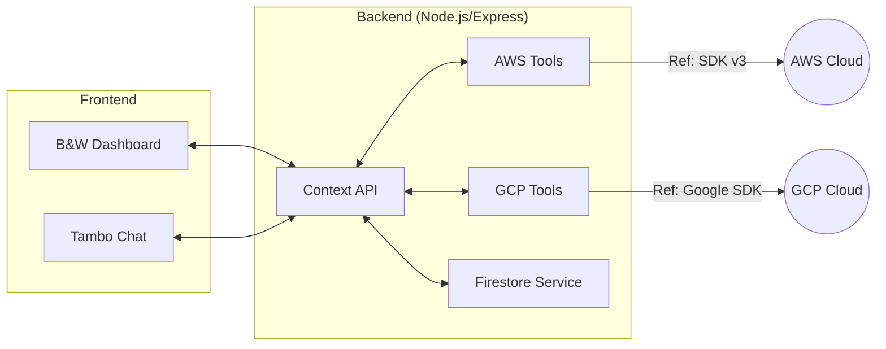
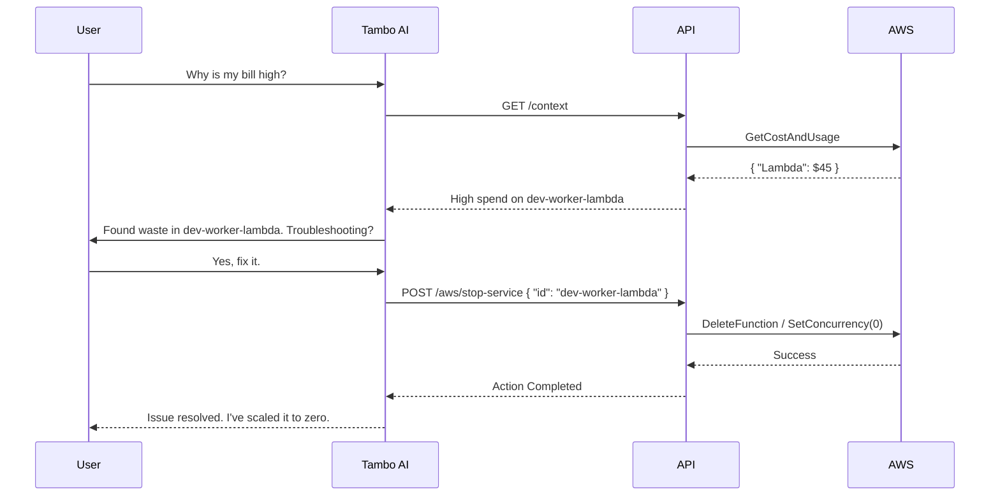

# System Design: SafeOps Co-pilot

This document visualizes the core architecture and troubleshooting workflows.

## High-Level Architecture

```mermaid
graph LR
    subgraph "Frontend"
        UI[B&W Dashboard]
        TC[Tambo Chat]
    end

    subgraph "Backend (Node.js/Express)"
        API[Context API]
        AWS[AWS Tools]
        GCP[GCP Tools]
        FS[Firestore Service]
    end

    UI <--> API
    TC <--> API
    API <--> FS
    API <--> AWS
    API <--> GCP

    AWS -->|Ref: SDK v3| CloudAWS((AWS Cloud))
    GCP -->|Ref: Google SDK| CloudGCP((GCP Cloud))
```

## Agentic Troubleshooting Loop

```mermaid
sequenceDiagram
    participant User
    participant Agent as Tambo AI
    participant API
    participant AWS

    User->>Agent: Why is my bill high?
    Agent->>API: GET /context
    API->>AWS: GetCostAndUsage
    AWS-->>API: { "Lambda": $45 }
    API-->>Agent: High spend on dev-worker-lambda
    Agent->>User: Found waste in dev-worker-lambda. Troubleshooting?
    User->>Agent: Yes, fix it.
    Agent->>API: POST /aws/stop-service { "id": "dev-worker-lambda" }
    API->>AWS: DeleteFunction / SetConcurrency(0)
    AWS-->>API: Success
    API-->>Agent: Action Completed
    Agent-->>User: Issue resolved. I've scaled it to zero.
```
